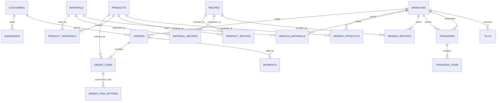

# Database Structure

This document gives a public, logical overview of the Sourdough database. The production application uses a relational database (MySQL/MariaDB); its Laravel migrations are the source of truth for the deployed schema.

This showcase intentionally documents domains, representative tables, and key relationships rather than publishing full DDL, all columns, or production data. Table details may evolve as the application changes.

## Domain Map

| Domain                   | Representative tables                                                                                                 | Purpose                                                                         |
| ------------------------ | --------------------------------------------------------------------------------------------------------------------- | ------------------------------------------------------------------------------- |
| Customers                | `customers`, `addresses`, `loyalty_points`, `wish_list`                                                               | Customer accounts, delivery locations, loyalty history, and saved products      |
| Product catalog          | `categories`, `products`, `options`, `product_options`, `offers`, `variants`                                          | Product browsing, customization, and promotions                                 |
| Ingredients and recipes  | `materials`, `recipes`, `material_recipes`, `product_materials`, `product_recipes`, `units`                           | Ingredient definitions, unit conversions, recipes, and product inputs           |
| Branch inventory         | `branches`, `branch_materials`, `branch_recipes`, `branch_products`                                                   | Stock balances and thresholds for each branch                                   |
| Orders and checkout      | `orders`, `order_items`, `order_item_options`, `payments`, `carts`, `cart_items`                                      | Customer and POS orders, line items, selected options, payments, and carts      |
| Locations                | `countries`, `states`, `cities`, `branches`, `tables`                                                                 | Geographic data, bakery locations, and dine-in tables                           |
| Staff and access         | `users`, `drivers`, `workstations`, `personal_access_tokens`                                                          | Staff identities, delivery drivers, POS devices, and API tokens                 |
| Purchasing and transfers | `suppliers`, `purchases`, `purchase_materials`, `transfers`, `transfer_items`                                         | Supplier purchases and branch-to-branch stock movement                          |
| Production               | `production_orders`, `production_order_items`, `recipe_productions`, `recipe_production_items`, `product_productions` | Planned and completed production activity                                       |
| Stock history and waste  | `stock_movements`, `recipe_stock_transactions`, `material_wastes`, `product_wastes`                                   | Auditable inventory changes and recorded losses                                 |
| POS finance              | `tills`, `drawer_operations`, `drawer_reasons`                                                                        | Cashier shifts, cash movements, and operation reasons                           |
| Application settings     | `general_settings`, `receipt_settings`, `loyalty_settings`, `mobile_updates`                                          | Operational configuration, receipts, loyalty rules, and mobile release metadata |

Laravel and Filament also rely on framework tables for jobs, cache, sessions, notifications, and import/export processing.

## Core Relationships

The diagram is conceptual. Some relationships are represented through pivot, detail, or polymorphic records in the application schema.

## How the Main Data Flows Fit Together

### Customer and POS Orders

An order belongs to a customer when applicable and is associated with the branch fulfilling it. Its order items reference products and preserve ordered quantities and prices. Option detail records capture customizations. Payments are recorded separately so an order can retain payment history.

### Product Costs and Recipes

Products can reference materials directly, recipes, or both. Recipes are composed from materials. Unit conversion and input costs support cost calculations for recipe batches and finished products.

### Branch Stock

Product, material, and recipe stock are represented per branch. Purchasing, production, sales, adjustments, and transfers update these balances through application workflows and record stock history where applicable.

### Transfers and Production

Transfers connect a source branch and a destination branch and contain transfer items. Production records capture planned quantities, actual output, and consumed inputs so operations can reconcile stock and costs.

## Data Model Principles

- Branch inventory is modeled separately from global product, material, and recipe definitions.
- Order headers, line items, option details, and payments are separate records with explicit relationships.
- Recipe and product input associations support many-to-many composition with quantities.
- Stock changes are traceable through transaction and movement records in addition to current balances.
- Authentication and operational settings are stored separately from commerce records.

For project technologies and application scope, see the [showcase README](README.md). For how the application components use these domains, see the [Architecture Overview](ARCHITECTURE_OVERVIEW.md) and [Project Skills and Features](PROJECT_SKILLS_AND_FEATURES.md).

## Showcase Documentation

- [Showcase README](README.md)
- [Architecture Overview](ARCHITECTURE_OVERVIEW.md)
- [Project Skills and Features](PROJECT_SKILLS_AND_FEATURES.md)
